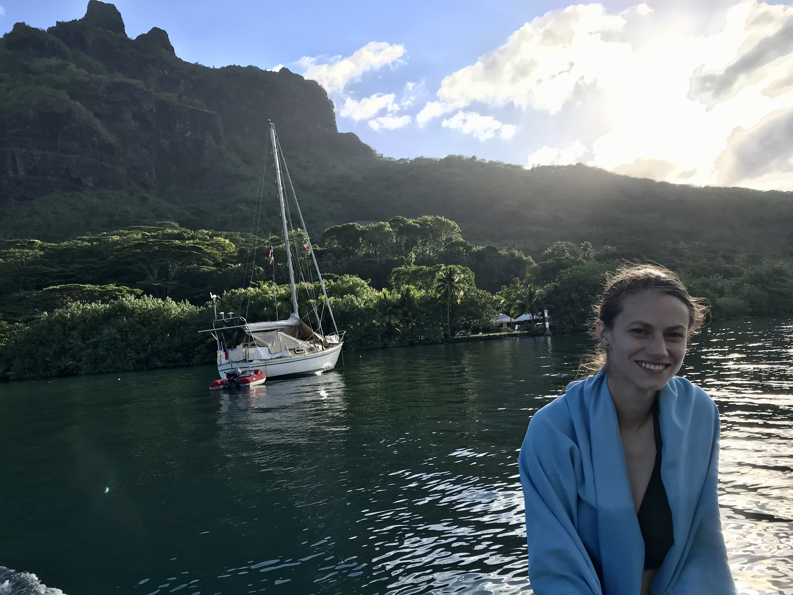

# Conservation for Species on the Move

### Disentangling drivers and impact of adult versus larval movement

Unlike most species, fish movement occurs across two distinct life-stages, larval and adult. When studying the drivers of fish and the implications for conservation design, however, these life stages are often considered individually. To address this gap, I took a trait-based approach to explore how and why different combinations of adult and larval movement arise in fish species (Bradley and Caughman et al., 2024 Scientific Data; Rosenberg, Bradley, Gaines, and Caughman, in Review Marine Ecology Progress Series). With this added understanding of what movement combinations are possible, I am answering a range of questions from which life stage should we focus on for MPA design (Caughman et al., in Prep) to if there are combinations of adult and larval movement that benefit most when tracking climate change. Currently, this work is theoretical, but I hope to apply the concept to real-life case studies for MPA design using high-resolution habitat and ocean current information.

### Conservation in a human impacted world

Human impacts are threatening species across the planet at global and local scales. These threats range from indirect effects, such as climate change, to direct impacts, such as extraction activity or even human presence. Particularly, as many protected areas balance access and conservation goals, I look at how human impacts within protected areas impact species behaviors, especially when it comes to movement. In the marine realm, I've shown that due to a release from fishing pressure, marine protected areas could have unintended consequences for species futures in climate change by reducing their movement rate (Caughman et al., 2024 Global Change Biology) and that retention bans are not enough to substantially reduce shark mortality due to death rates post-release for many species (Feitosa and Caughman et al., 2025 Fish and Fisheries). In California, I'm synthesizing information on how California's current protected areas support both human use and biodiversity and what effects this has on species behavior within these parks in order to inform recreation management (Caughman et al., in Prep). 

### Determining drivers of species spatial patterns across scales

In the face of global change, it is important to understand the drivers of species’ space use across scales. From species distributions to individual behavior choices, I employ statistical models to determine where species occur in space. I am particularly interested in exploring beyond the mean to determine how variability affects species choices. 

### In the Field

#### Santa Barbara and Channel Islands eDNA 

|                             |                             |
|---------------------------- |---------------------------- |
|     | |

#### Mo'orea Coral Reef LTER
|                             |                             |
|---------------------------- |---------------------------- |
|  | |

I spent June 2021 in Mo'orea, French Polynesia at the Gump Station assisting Mark Hay's lab as a reserach technician. 

|                             |                             |
|---------------------------- |---------------------------- |
|      |      |
