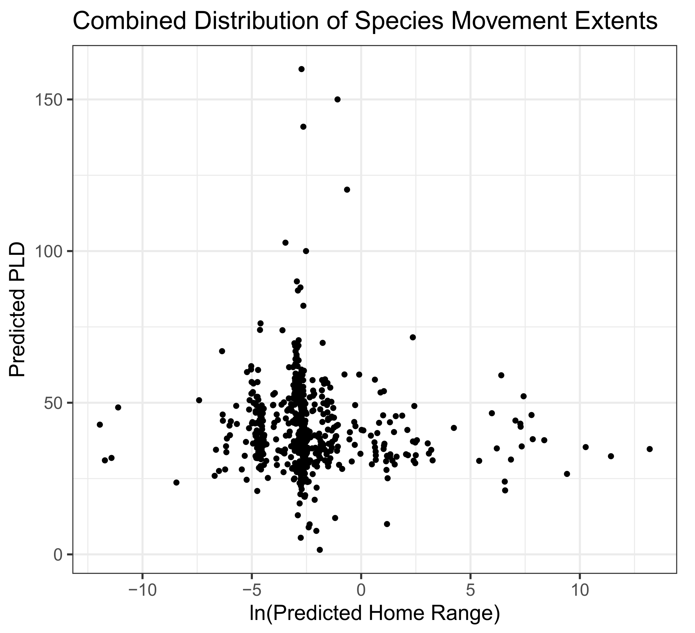
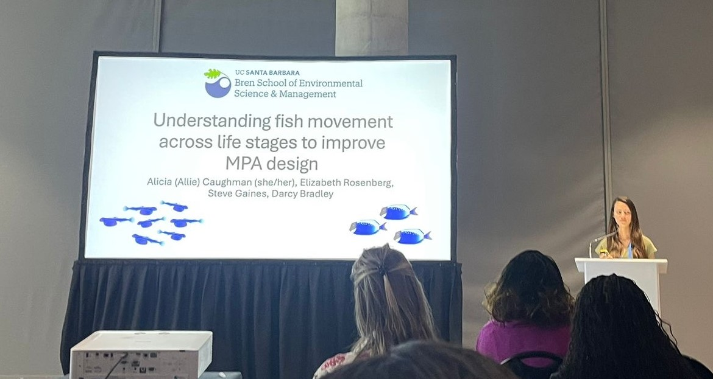
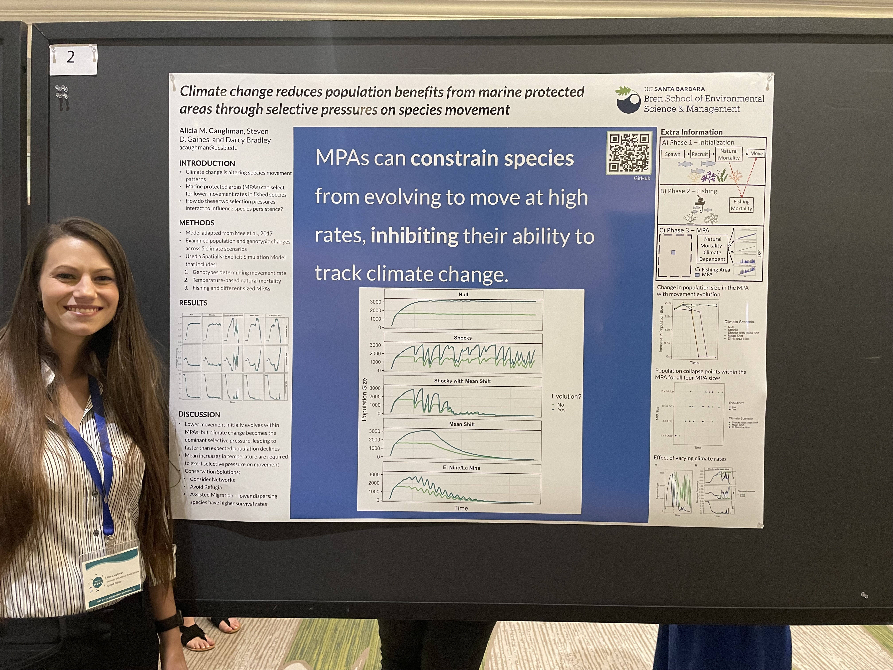
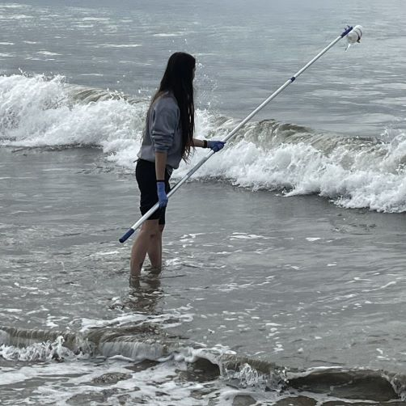
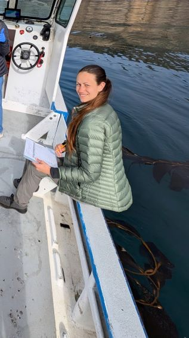
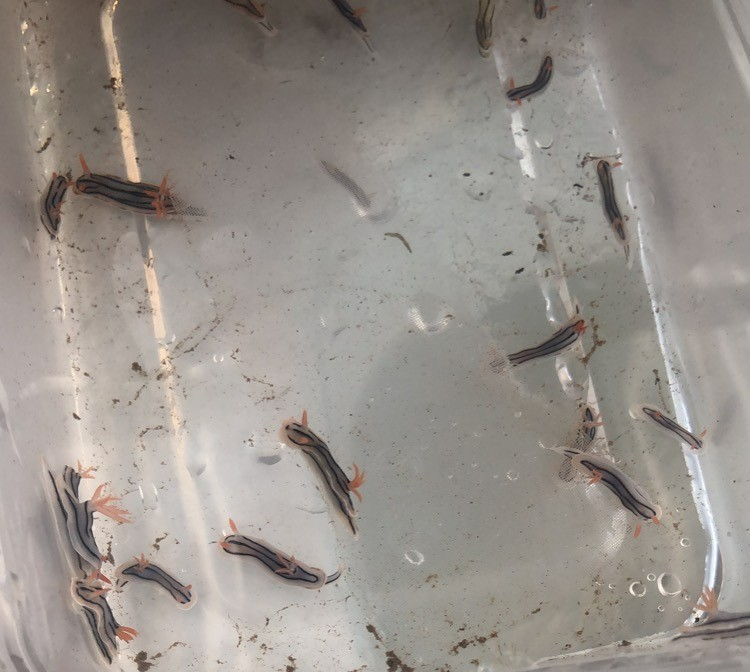
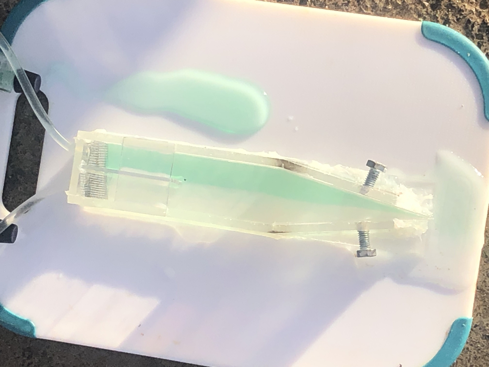
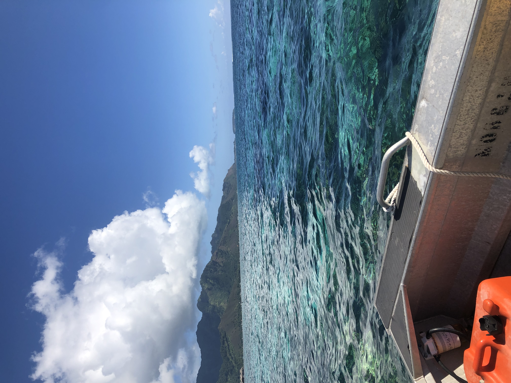

# Conservation for Species on the Move

### Disentangling drivers and impact of adult versus larval movement

Unlike most species, fish movement occurs across two distinct life-stages, larval and adult. When studying the drivers of fish and the implications for conservation design, however, these life stages are often considered individually. To address this gap, I took a trait-based approach to explore how and why different combinations of adult and larval movement arise in fish species (Bradley and Caughman et al., 2024 Scientific Data; Rosenberg, Bradley, Gaines, and Caughman, in Review Marine Ecology Progress Series). Species display a tendency toward moderate movement at at least one life stage.
 
With this added understanding of what movement combinations are possible, I am answering a range of questions about the relative impact of adult and larval movement MPA design (Caughman et al., in Prep) to tracking climate change and life time fitness. Currently, this work is theoretical, but I hope to apply the concept to real-life case studies for MPA design and distribution shifting using high-resolution habitat and ocean current information.

### Incoroporating species movement into marine policy

Designing future-proofed protected areas requires understanding drivers of species movement to determine how biodiversity patterns may change over time. From species distributions to individual behavior choices, I employ statistical models to determine where species occur in space and why. This includes understanding patterns adult spillover due to habitat configuration and using eDNA in tandem with species distribution models to detect how species distributions overlap with current MPA networks. Additionally, I've shown that due to a release from fishing pressure, marine protected areas could have unintended consequences for species futures in climate change by reducing their movement rate (Caughman et al., 2024 Global Change Biology) and that retention bans are not enough to substantially reduce shark mortality due to death rates post-release for many species (Feitosa and Caughman et al., 2025 Fish and Fisheries). 

### Understanding the biodiversity impacts of human movement

The importance of wildlife movement has long been considered in ecology and conservation, but human movements have not, due to challenges measuring human behavior. In California, I'm synthesizing information on how California's current protected areas support both human use and biodiversity and what effects this has on species behavior within these parks in order to inform recreation management (Caughman et al., in Prep). At sea, I am using vessel location data to calculate the predictability of marine-based human activity globally, utilizing vessel presence and tracking information from Global Fishing Watch. I will continue to apply this data to a broad range of questions, from species behavioral responses and biodiversity patterns given marine policy, to informing ecological consequences of human-dominated landscapes and the identification of effective conservation measures to address them. 

### In the Field

#### Santa Barbara and Channel Islands eDNA 

|                             |                             |
|---------------------------- |---------------------------- |
|    |    |

#### Mo'orea Coral Reef LTER

I spent June 2021 in Mo'orea, French Polynesia at the Gump Station assisting Mark Hay's lab as a reserach technician. 

|                             |                             |                |
|---------------------------- |---------------------------- |----------------|
|      |      |                |
