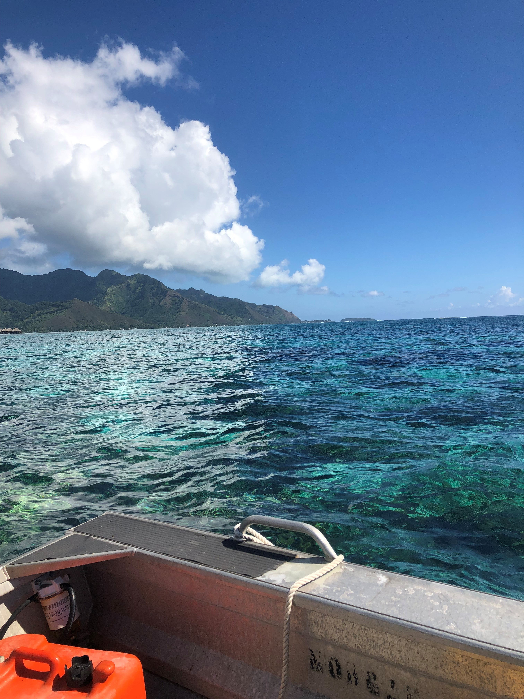

### Disentangling drivers and impact of adult versus larval movement

### Fish movement evolution in the anthropocene

### Habitat Usage and Climate Change Impacts

### **D**iscipline **B**ased **E**ducation **R**esearch (DBER)

#### Student's attitudes towards math and CS

Quantitative and computational skills are required of 21st-century biologists. It is important to understand how students perceive math and CS subjects and whether those perceptions are linked or operate contradictory to determine instructional best practices. We aimed to 1) determine biology students’ perceptions of math and CS in biological contexts, 2) measure the linkage of those perceptions, and 3) examine additional factors affecting attitudes. Math and CS values exhibited positive correlations, but Utility and Cost were more negative for CS, largely made more positive by prior exposure to CS. Given these findings, we make educational recommendations for CS and math exposure early, often, and embedded in the biology curriculum. 

### In the Field

#### Mo'orea Coral Reef LTER
|                             |                             |
|---------------------------- |---------------------------- |
|  | |

I spent June 2021 in Mo'orea, French Polynesia at the Gump Station assisting Mark Hay's lab as a reserach technician. As part of my work I: 

* Collected samples of nudibranchs, sea hares, crabs, macroalgae, and turf algae.

* Placed settlement panels and fertilizer on the reef. 
* Conducted feeding choice assays and flume chemical cue assays on nudibranchs, sea hares, and crabs.

